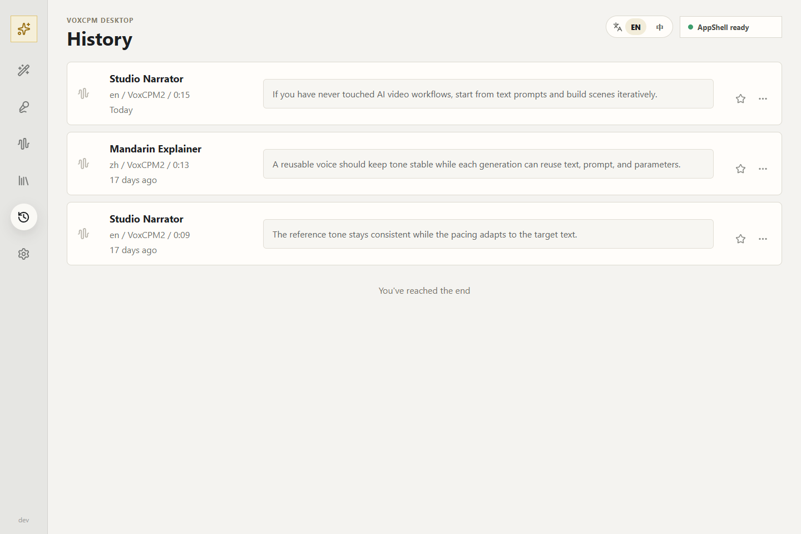
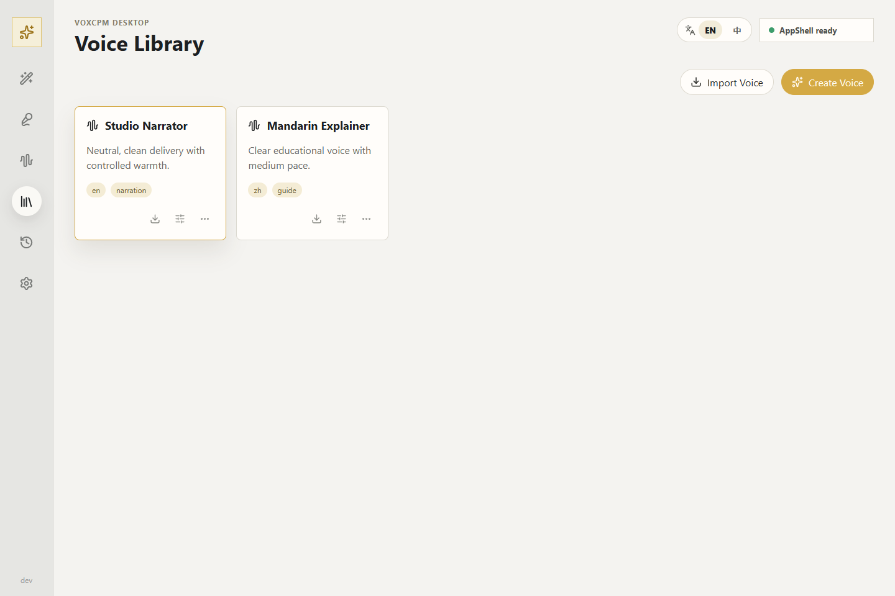

<div align="center">
  <h1>VoxCPM-Box</h1>
  <p><strong>A local desktop workspace for practical VoxCPM voiceover workflows.</strong></p>
  <p>Video narration &middot; AIGC short-film dubbing &middot; Reusable voices &middot; Generation history</p>

  <p>
    <a href="https://github.com/OpenBMB/VoxCPM"></a>
    
    
    
  </p>
</div>



VoxCPM-Box is an independent desktop app layer built on top of [OpenBMB/VoxCPM](https://github.com/OpenBMB/VoxCPM). It is designed for everyday local voiceover work while preserving the original VoxCPM source and Gradio development route.

> VoxCPM-Box is currently a source-development AppShell. Native generation services and persistent app features are being connected incrementally.

## Project Goals

- Self-use first: make VoxCPM easier to use for daily local dubbing workflows.
- Open-source friendly: keep changes structured so useful fixes can still be contributed upstream.
- Preserve upstream source: avoid rewriting core model code or the original Gradio WebUI.
- Build product features in the app layer: saved voices, history, scripts, batch tasks, and roles.

## Current Status

Implemented:

- Windows menu launcher for the original VoxCPM WebUI and LoRA WebUI.
- Electron + React + TypeScript AppShell development route.
- Bilingual AppShell UI switch: English / Chinese.
- Project-local FFmpeg wrapper support.
- Local SQLite/file app service layer for saved voices and generation history metadata.
- App development documentation under `docs/app-dev/`.

In progress / planned:

- Native AppShell save/import actions for the Voice Library.
- Generation execution integration that records History from native AppShell controls.
- Script Breakdown for splitting long scripts into smaller generation tasks.
- Batch Task Queue for multi-segment voiceover work.
- Role Profiles for character settings, notes, voice choice, and prompt guidance.

## AppShell Preview

The current AppShell establishes the desktop information architecture before persistent services are connected.

| Generation History | Voice Library |
|---|---|
| Review outputs and reusable generation context. | Organize saved reference voices for repeated use. |
|  |  |

Screenshots use development seed data; persistent Voice Library and Generation History services are still planned work.

## Two Routes

VoxCPM-Box intentionally keeps two separate routes.

### AppShell route

Use this route for the VoxCPM-Box desktop app experience:

```bat
start_electron_shell.bat
```

Or without a visible terminal:

```bat
start_electron_shell.vbs
```

Development command:

```bat
npm.cmd install
npm.cmd run dev
```

The AppShell is not a Gradio UI container. It is a native desktop app layer that will connect to app adapters/services as features are implemented.

### Legacy/developer Gradio route

Use this route to run the original VoxCPM WebUI and verify upstream behavior:

```bat
start_voxcpm.bat
```

Direct command example:

```bat
python run_with_local_ffmpeg.py app.py --port 8808 --device cuda
```

The original route is kept for source-level development, upstream sync checks, and compatibility testing.

## Recommended Development Model

For long-term maintenance, use this project as a derivative app project rather than a direct rewrite of VoxCPM.

Recommended repository roles:

- `VoxCPM`: upstream source sync and upstream contribution testing.
- `VoxCPM-Box`: desktop app shell, local app data, user workflows, and product features.

Recommended branch roles inside this repository:

- `main`: stable project branch.
- `app-shell-react`: current AppShell development branch.
- `feature/*`: focused feature branches such as `feature/voice-library` or `feature/batch-tasks`.

## Upstream Sync Strategy

When pulling new upstream VoxCPM changes:

1. Preserve upstream files and entrypoints first.
2. Verify the legacy/developer Gradio route still starts.
3. Verify the AppShell route still starts independently.
4. Update app adapters/services if upstream launch arguments or callable behavior changed.
5. Avoid editing model internals unless the change is a small upstream-worthy fix.

Good upstream contribution candidates:

- Windows compatibility fixes.
- Local FFmpeg/path handling improvements.
- CLI or documentation fixes.
- Small bugs that benefit all VoxCPM users.

Better kept in VoxCPM-Box:

- Electron AppShell.
- Voice Library.
- Generation History.
- Script Breakdown.
- Batch Task Queue.
- Role Profiles.
- Local app data management.

## Project Layout

Important app-layer paths:

```text
electron/                 Electron main process and React renderer
docs/app-dev/             App development documentation
run_with_local_ffmpeg.py  Project-local FFmpeg launcher wrapper
start_voxcpm.bat          Original VoxCPM WebUI launcher
start_electron_shell.bat  VoxCPM-Box AppShell launcher
```

Planned app data layout:

```text
data/app/app.sqlite3
data/app/voices/
data/app/generations/
data/app/tmp/
```

## Documentation

The app-layer technical documentation is maintained in:

```text
docs/app-dev/
```

Start here:

- [App Development Docs](docs/app-dev/README.md)
- [Frontend App Shell Specification](docs/app-dev/08-frontend-app-shell.md)
- [VoxCPM-Box Scope and Upstream Sync](docs/app-dev/09-voxcpm-box-scope-and-upstream-sync.md)

## Development Checks

Frontend type check:

```bat
npm.cmd run typecheck
```

Frontend build:

```bat
npm.cmd run build
```

Electron script syntax check:

```bat
node --check electron\main.js
node --check electron\preload.js
node --check electron\dev-runner.js
```

## Relationship to VoxCPM

VoxCPM-Box is not an official VoxCPM project. It is an independent desktop app layer built on top of VoxCPM for local voiceover workflows.

The goal is to benefit from upstream VoxCPM improvements while keeping product-specific desktop features in a separate, maintainable app layer.

## License

VoxCPM-Box should preserve upstream VoxCPM license requirements and attribution. Check the upstream VoxCPM license before redistributing model weights, source code, or bundled runtime artifacts.
